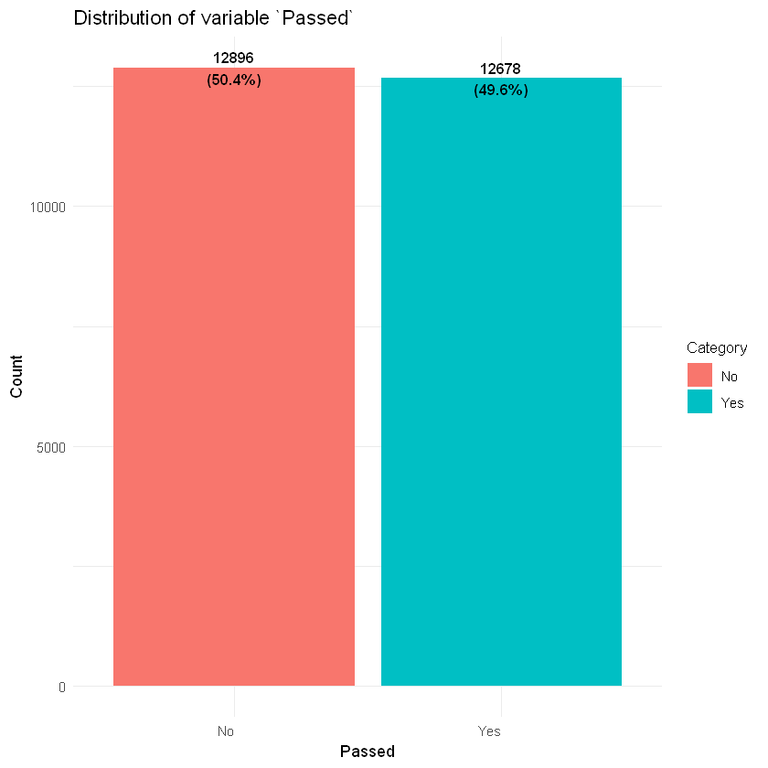
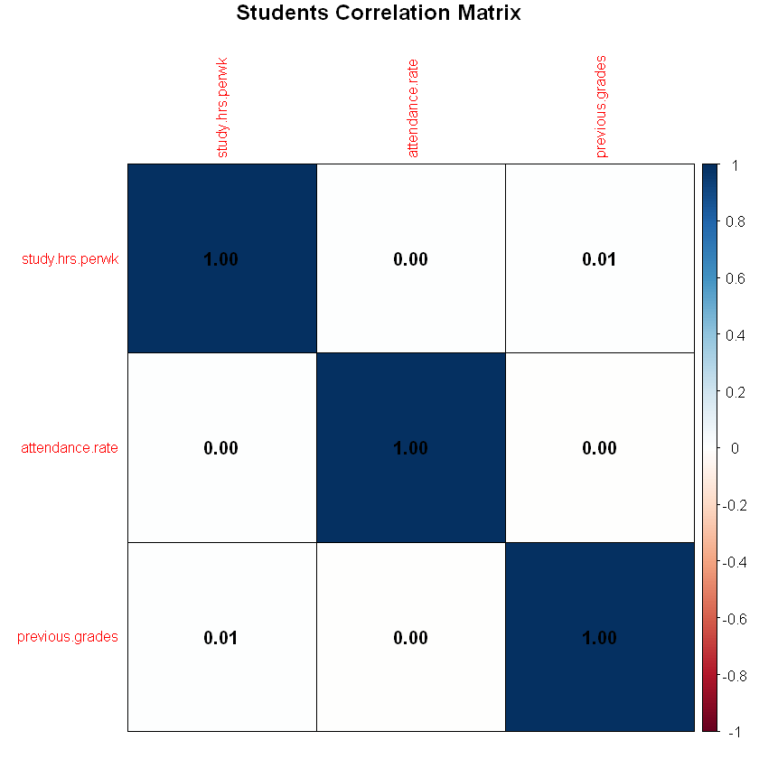

# Student Performance Prediction

**Author(s):** Pablo Castillo Garita

**Date:** September, 2024

---

## Table of Contents
1. [Introduction](#introduction)
2. [Methodology](#methodology)
   - [Data Cleaning](#data-cleaning)
   - [Exploratory Data Analysis (EDA)](#exploratory-data-analysis-eda)
   - [Predictive Modeling](#predictive-modeling)
3. [Results](#results)
4. [Discussion](#discussion)
5. [Conclusions](#conclusions)
6. [References](#references)
7. [Appendices](#appendices)

---

## Introduction
- **Problem Description:** Educational institutions aim to identify students at risk of academic difficulties to offer timely support. This project analyzes student data to pinpoint the key factors influencing performance and develop a predictive model that accurately forecasts a student's likelihood of passing or failing a course.
- **Project Objectives:** The primary objectives include cleaning the student dataset, conducting exploratory data analysis (EDA) to understand key patterns, and developing a predictive model to estimate the likelihood of a student passing.
- **Scope:** The project covers data cleaning, EDA, and predictive modeling, while excluding the deployment of the model into a production environment.

## Methodology

### Dataset Description
- **Source of the Dataset:** The dataset was obtained from Kaggles. It can be accessed [here](https://www.kaggle.com/datasets/souradippal/student-performance-prediction).
- **Brief Overview:** The dataset includes academic and demographic factors.
- **Number of Records and Variables:** The dataset contains 40,000 rows and 7 columns.
- **Variable Descriptions:**
    + ``StudentID``: Unique identifier for each student (Numerical).
    + ``Study.Hours.per.Week``: Average number of hours spent studying per week (Numerical).
    + ``Attendance.Rate``: Percentage of classes attended by the student (Numerical).
    + ``Previous.Grades``: Average grades from previous courses (Numerical).
    + ``Parent.Education.Level``: Highest education level achieved by the student's parents (Categorical).
    + ``Participation.in.Extracurricular.Activities``: Whether the student participates in extracurricular activities (Yes/No) (Categorical).
    + ``Passed``: Whether the student passed the course (Yes/No) (Categorical).
- **Any Missing Data:** Approximately 5% of the data contains missing values randomly distributed across several columns.
- **Data Errors:** Some entries contain incorrect or unrealistic values.

### Data Cleaning
- **Initial Data Description:** The dataset had several missing values, inconsistencies in categorical data, and potential outliers in numerical columns.
- **Cleaning Process:**
    1. Initial review.
    2. Removal of irrelevant columns.
    3. Change column names.
    4. Handling duplicates.
    5. Handling null values.
    6. Data type conversion
    7. Error and anomaly correction.
    8. Outlier data handling.
    9. Data validation.
    10. Save the cleaned data in a new dataset.

- **Cleaning Results:** After data cleaning, the dataset was reduced to 25574 records. Missing values where omitted.

### Exploratory Data Analysis (EDA)
- **Summary of Descriptive Statistics:** The average student studies 9.9 hours per week. The median attendance rate is 72.6%, and the median previous grade is 65.10%. Based on additional analysis, the pass rate is approximately 49.6%.
- **Visualizations:**
    + **Histograms:** The histograms that were displayed show a bell shape, also known as the shape of the normal distribution, indicating that the data follow a normal distribution. In a normal distribution, most values are clustered around the mean, with frequencies decreasing symmetrically as the values move away from the center.
    + **Bar Plots:** The density plots show that there is a very level distribution of about 50%.
    + **Correlation Matrix:** The correlation between all the variables is very weak, in fact, the linear relationship between them is null.
    + **Density Plots:** Density plots showing significant overlap between the predictor variables and the variable to be predicted (in this case, whether the student passed or failed) indicate that the predictor variables do not provide clear differentiation between classes. This suggests that the predictor variables may not be suitable for use in a predictive model.
- **Key Findings:** The exploratory data analysis reveals that when predictor variables have a very balanced distribution among the different categories of the target variable, it can be more difficult for the model to identify clear and distinct patterns. This can negatively affect the performance of the predictive model, increasing the probability that its accuracy is close to 50%. This level of accuracy suggests that the model may be barely improving random prediction and is not capturing significant differences between classes.

### Predictive Modeling
- **Model Selection:**
    1. K-Nearest Neighbors (KNN)
    2. Decision Trees
    3. Random Forest
    4. Support Vector Machines (SVM)
- **Training and Evaluation:** The model was trained on 70% of the data and tested on the remaining 30%. Metrics used include accuracy, sensitivity, specificity, positive predictive value, negative predictive value, prevalence, detection rate, detection prevalence, balanced accuracy, Kappa, and McNemar's test p-value.
- **Results and Predictions:** As mentioned above, all the models achieve an accuracy around 50%.

## Results
- **Summary of Findings:** The analysis confirmed that all the variables are weak predictors of student performance and don't have a correlation between them.
- **Visualizations and Tables:**

    - **Distribution of Passed:** The bar chart below illustrates the balanced of the variable ``Passed``.

    
    
    - **Correlation Matrix:** The correlation matrix below indicates that there is null correlation between the variables, suggesting that they are largely independent of one another.

    
    
    - **Evalution Metrics Dataframe:**

| Model         | Accuracy | Sensitivity | Specificity | Balanced Accuracy |
|---------------|:--------:|:-----------:|:-----------:|:-----------------:|
| KNN          | 0.4974   |  0.4907     |  0.5040     |      0.4973        |
| Decision Trees         | 0.5043   |  0.0000     |  1.0000     |      0.5000        |
| Random Forest  | 0.5026   |  0.4788     |  0.5260     |      0.5024        |
| Linear        | 0.4971   |  0.3894     |  0.6030     |      0.4962        |
| Radial        | 0.4952   |  0.4115     |  0.5774     |      0.4945        |
| Polynomial    | 0.4960   |  0.2085     |  0.7785     |      0.4935        |
| Sigmoid       | 0.5022   |  0.4996     |  0.5048     |      0.5022        |

## Discussion
- **Interpretation of Results:** The model's performance suggests it may not be reliable for accurately predicting outcomes. With an accuracy overall 50%, the model performs slightly worse than random guessing. This implies that the model may not be effective in identifying at-risk students, and there is a high likelihood of both false positives and false negatives.
- **Limitations of the Analysis:** The dataset is hypothetical and may not fully represent real-world educational environments. Additionally, variables such as teacher feedback and student engagement, which might also affect performance, were not included.

## Conclusions
- **Summary:** The project successfully cleaned the data, conducted EDA, but developed a predictive model that can't assist in identifying students at risk of failing.
- **Future Recommendations:** Future work could focus on improving data quality by collecting additional relevant features, such as student engagement and teacher feedback, or by refining existing features through feature engineering. Additionally, considering alternative data preprocessing techniques, such as dimensionality reduction or resampling methods, could help improve model performance. It may also be valuable to conduct more in-depth exploratory data analysis to uncover hidden patterns or relationships that were not initially apparent.
- **Lessons Learned:** The importance of data cleaning and the impact of visualizing distribution plots of the variables to get to know if the its viable to make a prediction model.

